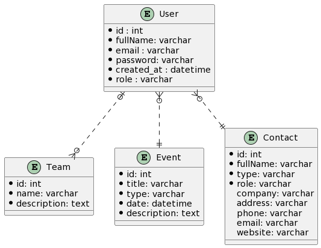

    
Sym-CRM - Cahier des charges

    
Lucien HAMM

    
8 mars 2022

Table des matières

[toc]

# Sym-CRM - Dossier d'analyse

## Les normes

### Le design responsive

Le design de l'application sera responsive, en s'adaptant à plusieurs tailles d'écran selon l'appareil d'un utilisateur (ordinateur, smartphone, tablette).

### La norme RGPD (Réglement Général de la Protection des Données)

Cette norme a pour but de responsabiliser les organismes traitant des données personnelles.

C'est à l'origine une directive européenne, transposée en 2018 en droit français.

Elle permet d’encadrer le traitement et la circulation des données à caractère personnel sur le territoire européen.

Ce règlement est obligatoire, et indique que les données personnelles doivent être :
- traitées de manière licite, loyale et transparente
- collectées à des fins déterminées, explicites et légitimes
- adéquates, pertinentes et limitées
- exactes et tenues à jour
- conservées pendant une durée raisonnable
- traitées de façon à garantir leur protection

Il est donc nécessaire de :
- définir une personne chargée de la protection des données (l'administrateur)
- lister les données et leur utilité
- repérer les données à risques et les protéger
- respecter le droit des utilisateurs concernant la collecte de leurs données, leur modification et leur suppression
- s’assurer que les sous-traitants respectent la norme RGPD

Dans le cas de cette application, les éléments suivants seront à prévoir :
- une page de **Mentions Légales** rappelant à l'utilisateur ses droits concernant ses données, leur édition et leur suppression
- une page de **Politique de Confidentialité**
- la récolte d'informations essentielles et pertinentes pour un utilisateur, à savoir son pseudo et son adresse e-mail
- la sécurisation d'un mot de passe utilisateur avec une méthode de hachage
- un message d'information sur l'utilisation des cookies avec un bouton de validation

### La sécurité

L'application veillera à respecter certains principes de sécurité en incluant :
- des protections contre certaines failles (XSS, CSRF, DDoS, injections SQL...)
- un système de rôles (utilisateur, modérateur, administrateur, super administrateur) permettant un accès à certaines pages et fonctionnalités
- un système de hachage des mots de passe
- un système de vérification d'identité, permettant à un seul utilisateur d'accéder à ses données (consultation de profil, modification et suppression des suggestions et identifiants)
- une page de redirection en cas d'adresse invalide (erreur 404)

## Les composants

### Le layout

**Vue** : base.html.twig

Il s'agit du modèle de base pour l'ensemble des pages et du design.

### Le menu de navigation

**Vue** : partials/navbar.html.twig

Un menu de navigation du site est visible tout en haut de chaque page et contient :
- le titre **Sym-CRM** tout à gauche, avec un lien vers la page d'accueil
- les liens des différentes pages à droite dans cet ordre :
    - Déconnexion (si connecté)
    - le nom complet (prénom et nom, société) de l'utilisateur, avec un lien vers sa page de profil
    - Utilisateurs (si administrateur)
    - Equipes (si manager)
    - Contacts (liste des contacts, si connecté)
    - Evénements (liste des événements, si connecté)

### Le pied de page

**Vue** : partials/footer.html.twig

Un pied de page est visible tout en bas de chaque page avec la mention **Sym-CRM** &copy; 2022 et des liens vers les pages :
- des **Mentions Légales**
- de la **Politique de Confidentialité**

### Les messages d'alerte

**Vue** : partials/alerts.html.twig

Les messages d'alerte (ou flash) s'affichent pour valider une action ou notifier une erreur comme :
- la confirmation d'une (dé)connexion
- un champ non valide dans un formulaire
- l'ajout d'un nouveau contact

### Les pages

#### La page d'accueil

**Contrôleur** : HomeController (index) 
**Vue** : index.html.twig 
**Rôle** : visiteur

Il s'agit de la page principale et par défaut, qui sert aussi de page de connexion pour l'ensemble des utilisateurs.

#### Les Mentions Légales

**Vue** : legals/mentions.html.twig

Il s'agit d'une fenêtre modale avec les mentions légales de l'application.

#### La Politique de Confidentialité

**Vue** : legals/policy.html.twig

Il s'agit d'une fenêtre modale avec la politique de confidentialité de l'application.

#### Le tableau de bord

**Contrôleur** : AdminController (stats) 
**Vue** : admin/dashboard.html.twig 
**Rôle** : utilisateur

Il s'agit de la page principale et par défaut d'un utilisateur connecté.

On y retrouve l'ensemble des statistiques avec :
- le nombre d'utilisateurs
- le nombre d'équipes
- le nombre d'événements
- le nombre de contacts

On y retrouve aussi les listes des 5 derniers :
- contacts (nom complet, type et rôle)
- événements (titre, date et heure)

### Les utilisateurs

#### Les rôles des utilisateurs

Les utilisateurs sont définis par des rôles avec différents privilèges
- le **super-admin**, qui peut tout faire.
- l'**administrateur**, qui peut gérer l'ensemble des utilisateurs, des équipes, des événements et des contacts.
- le **manager**, qui peut gérer des équipes, des événements et des contacts.
- le simple **utilisateur**, qui peut gérer ses événements et ses contacts.

#### Liste des utilisateurs

**Contrôleur** : UserController (list) 
**Modèle** : User 
**Vue** : users/list_users.html.twig 
**Rôle** : utilisateur

Cette page liste l'ensemble des utilisateurs sous forme de tableau avec :
- le nom complet de l'utilisateur (société ou prénom et nom)
- le rôle de l'utilisateur (Super-Admin, Administrateur, Manager, Utilisateur)
- la date d'inscription, au format JJ/MM/AAAA (ex : 11/02/2022)
- des boutons d'édition et de suppression (administrateur)

Le pseudo de l'utilisateur sera colorié :
- en vert, si c'est un manager
- en orange, si c'est un administrateur
- en rouge, si c'est le super-admin

Un message s'affiche en cas d'absence d'utilisateur inscrit.

(+)

On peut choisir l'ordre d'affichage pour chaque colonne.

Les utilisateurs sont affichés par pages avec un nombre de 50 par défaut.

On peut choisir d'afficher 10, 20, 50, 100 ou 200 utilisateurs par page.

On peut filtrer l'ensemble des utilisateurs avec une barre de recherche.

#### Inscription d'un utilisateur

**Contrôleur** : UsersController (register) 
**Modèle** : User 
**Vue** : users/register.html.twig 
**Rôle** : utilisateur

Un utilisateur doit s'inscrire s'il souhaite accéder aux fonctionnalités du CRM.

Il devra indiquer :
- son nom complet (requis, alphanumérique, de 2 à 100 caractères)
- son adresse e-mail (requis, unique, e-mail valide, 100 caractères max)
- son mot de passe (requis, 8 à 32 caractères alphanumériques, avec au moins une minuscule, une majuscule et un chiffre)
- sa confirmation du mot de passe

Des messages d'erreur s'afficheront en-dessous de chaque champ mal renseigné.

(+)

La validation du formulaire se fait en temps réel avec des messages indiquant les règles de validation de chaque champ.

Un mot de passe peut comporter des caractères spéciaux ($, @, !, ?).

Le formulaire de connexion s'affiche dans une fenêtre modale.

#### Connexion d'un utilisateur

**Contrôleur** : UsersController (login) 
**Modèle** : User 
**Vue** : home/index.html.twig 
**Rôle** : visiteur

Un utilisateur est invité à se connecter avec son e-mail et son mot de passe.

#### Déconnexion d'un utilisateur

**Contrôleur** : UsersController (logout) 
**Modèle** : User 
**Redirection** : / (home) 
**Rôle** : utilisateur

Un utilisateur peut se déconnecter en cliquant sur le lien **Déconnexion** du menu de navigation.

Il est ensuite redirigé vers la page d'accueil avec un message de confirmation.

#### Profil d'un utilisateur

**Contrôleur** : UsersController (profile) 
**Modèle** : User 
**Vue** : users/profile.html.twig 
**Rôle** : utilisateur

Un utilisateur a accès à sa page de profil en cliquant sur son prénom et nom dans la barre de navigation principale.

Il peut modifier ses informations (prénom, nom, e-mail, téléphone) et sa photo de profil.

L'e-mail doit rester unique.

L'utilisateur peut aussi changer son mot de passe en indiquant :
- son ancien mot de passe
- son nouveau mot de passe
- la confirmation de son nouveau mot de passe

(+) La validation du formulaire se fait en temps réel.

#### Edition d'un utilisateur

**Contrôleur** : UsersController (edit) 
**Modèle** : User 
**Vue** : users/edit_user.html.twig 
**Rôle** : utilisateur

Un administrateur est redirigé vers un formulaire d'édition d'un utilisateur avec sa page de profil.

(+) Le formulaire d'édition est intégré dans une fenêtre modale.

#### Suppression d'un utilisateur

**Contrôleur** : UsersController (delete) 
**Modèle** : User 
**Vue** : users/delete_user.html.twig 
**Rôle** : utilisateur

Un administrateur est redirigé vers la page de suppression de l'utilisateur concerné.

La suppression d'un utilisateur entraîne également la suppression de l'ensemble de ses événements et contacts.

Ce même utilisateur sera supprimé de son équipe.

(+) Un administrateur déclenche une fenêtre modale (*) de confirmation de suppression de l'utilisateur concerné.

#### Mot de passe oublié

**Contrôleur** : UsersController (reset) 
**Modèle** : User 
**Vue** : users/reset.html.twig 
**Rôle** : visiteur

Un utilisateur peut demander un nouveau mot de passe si nécessaire en cliquant sur un lien **Mot de passe oublié**.

Il reçoit ensuite un e-mail avec son nouveau mot de passe.

#### Nouveau mot de passe

**Contrôleur** : UsersController (new_password) 
**Modèle** : User 
**Vue** : users/new_password.html.twig 
**Rôle** : visiteur

L'utilisateur est invité à cliquer sur le lien de confirmation de son e-mail indiquant son nouveau mot de passe.

Il est ensuite redirigé vers une page de confirmation de demande d'un nouveau mot de passe.

#### Envoyer une invitation

**Contrôleur** : UsersController (send) 
**Modèle** : User 
**Vue** : events/calendar.html.twig 
**Rôle** : visiteur

Un utilisateur envoie une invitation à un autre avec son adresse e-mail pour consulter son calendrier d'événements.

#### Accepter une invitation

**Contrôleur** : UsersController (accept) 
**Modèle** : User 
**Vue** : events/calendar.html.twig 
**Rôle** : visiteur

Un utilisateur reçoit une invitation d'un autre utilisateur par e-mail.

Il est libre de l'accepter ou de la refuser.

S'il l'accepte, il aura accès à son calendrier.

#### (+) Envoyer un message

Un utilisateur peut contacter un autre avec son adresse e-mail et un formulaire de contact dédié.

### Les équipes

#### Liste des équipes

**Contrôleur** : TeamsController (index) 
**Modèle** : Team 
**Vue** : teams/list_teams.html.twig 
**Rôle** : manager

Un manager peut voir l'ensemble des équipes avec :
- le nom
- la liste de ses membres (nom complet)

#### Ajout d'une équipe

**Contrôleur** : TeamsController (add) 
**Modèle** : Team 
**Vue** : teams/add_team.html.twig 
**Rôle** : manager

Un manager peut ajouter une équipe avec une page dédiée.

(+) L'ajout se fait avec une fenêtre modale.

#### Edition d'une équipe

**Contrôleur** : TeamsController (edit) 
**Modèle** : Team 
**Vue** : teams/edit_team.html.twig 
**Rôle** : manager

Un manager peut éditer une équipe avec une page dédiée.

(+) L'édition se fait avec une fenêtre modale.

#### Suppression d'une équipe

**Contrôleur** : TeamsController (delete) 
**Modèle** : Team 
**Vue** : teams/delete_team.html.twig 
**Rôle** : manager

Un manager peut supprimer une équipe avec une page dédiée.

(+) La suppression se fait avec une fenêtre modale.

#### Ajout d'un utilisateur dans une équipe

**Contrôleur** : TeamsController (addMember) 
**Modèles** : Team, User 
**Vue** : teams/list_teams.html.twig 
**Rôle** : manager

Un manager peut ajouter un utilisateur dans une équipe.

Il doit sélectionner cet utilisateur à partir d'une liste de choix.

(+) La sélection se fait avec une barre de recherche.

#### Transfert d'une équipe

**Contrôleur** : TeamsController (move) 
**Modèles** : Team, User 
**Vue** : teams/list_teams.html.twig 
**Rôle** : manager

Un manager peut transférer un utilisateur d'une équipe dans une autre.

### Les événements</h3>

#### Liste des événements

**Contrôleur** : EventsController (index) 
**Modèle** : Event 
**Vue** : events/list_events.html.twig 
**Rôle** : utilisateur

Un utilisateur peut consulter l'ensemble de ses événements avec un calendrier.

#### Consultation d'un événement

**Contrôleur** : EventsController (show) 
**Modèle** : Event 
**Vue** : events/show_event.html.twig 
**Rôle** : utilisateur

Un utilisateur peut consulter un événement sur une page dédiée à partir du calendrier.

#### Ajout d'un événement

**Contrôleur** : EventsController (add) 
**Modèle** : Event 
**Vue** : events/add_event.html.twig 
**Rôle** : utilisateur

Un utilisateur peut ajouter un événement à partir du calendrier avec :
- le titre
- le type (réunion, tâche) : bouton radio
- la date et l'heure
- la description (champ texte)

(+) L'ajout se fait avec une fenêtre modale.

#### Edition d'un événement

**Contrôleur** : EventsController (edit) 
**Modèle** : Event 
**Vue** : events/edit_event.html.twig 
**Rôle** : utilisateur

Un utilisateur peut éditer un événement à partir du calendrier et sur une page dédiée.

(+) L'édition se fait avec une fenêtre modale.

#### Suppression d'un événement

**Contrôleur** : EventsController (delete) 
**Modèle** : Event 
**Vue** : events/delete_event.html.twig 
**Rôle** : utilisateur

Un utilisateur peut supprimer un événement à partir du calendrier et sur une page dédiée.

(+) La suppression se fait avec une fenêtre modale.

### Les contacts

#### Liste des contacts

**Contrôleur** : ContactsController (index) 
**Modèle** : Contact 
**Vue** : contacts/list_contacts.html.twig 
**Rôle** : utilisateur

Chaque utilisateur pourra voir une liste complète des contacts sous forme de tableau avec :
- le nom complet
- le type (Particulier / Société)
- le rôle (Collaborateur, Client, Prestataire, Fournisseur)
- les coordonnées (adresse, numéro de téléphone, adresse e-mail, site web)

(+)

L'utilisateur pourra à terme :
- changer l'ordre d'affichage des contacts par colonne
- afficher N contacts par page
- filtrer les contacts avec une barre de recherche

#### Ajout d'un contact

**Contrôleur** : ContactsController (add) 
**Modèle** : Contact 
**Vue** : contacts/add_contact.html.twig 
**Rôle** : utilisateur

Un utilisateur peut ajouter un contact sur une page dédiée avec un formulaire et les champs suivants :
- le nom complet (requis, entre 3 et 80 caractères alphanumériques, - inclus)
- le type (bouton radio, Particulier / Société)
- le rôle (bouton radio, Collaborateur, Client, Prestataire, Fournisseur)
- le nom de la société (si particulier, optionnel, entre 3 et 80 caractères alphanumériques)
- l'adresse : rue, ville et code postal (en une ligne)
- le numéro de téléphone
- l'adresse e-mail
- le site web (optionnel)

#### Edition d'un contact

**Contrôleur** : ContactsController (edit) 
**Modèle** : Contact 
**Vue** : contacts/edit_contact.html.twig 
**Rôle** : utilisateur

Un utilisateur peut éditer un contact sur une page dédiée et le même formulaire qu'à l'ajout.

#### Suppression d'un contact

**Contrôleur** : ContactsController (delete) 
**Modèle** : Contact 
**Vue** : contacts/delete_contact.html.twig 
**Rôle** : utilisateur

Un utilisateur peut supprimer un contact sur une page dédiée.

(+) La suppression du contact se fait avec une fenêtre modale.

## La conception

La base de données de l'application est définie selon le modèle suivant :

