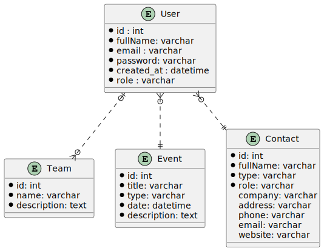

    
Sym-CRM - Cahier des charges

    
Lucien HAMM

    
8 mars 2022

Table des matières

[toc]

# Sym-CRM - Cahier des charges
## Les normes

### Le design responsive

Le design de l'application sera responsive, en s'adaptant à plusieurs tailles d'écran selon l'appareil d'un utilisateur (ordinateur, smartphone, tablette).

### La norme RGPD (Réglement Général de la Protection des Données)

Cette norme a pour but de responsabiliser les organismes traitant des données personnelles.

C'est à l'origine une directive européenne, transposée en 2018 en droit français.

Elle permet d’encadrer le traitement et la circulation des données à caractère personnel sur le territoire européen.

Ce règlement est obligatoire, et indique que les données personnelles doivent être :
- traitées de manière licite, loyale et transparente
- collectées à des fins déterminées, explicites et légitimes
- adéquates, pertinentes et limitées
- exactes et tenues à jour
- conservées pendant une durée raisonnable
- traitées de façon à garantir leur protection

Il est donc nécessaire de :
- définir une personne chargée de la protection des données (l'administrateur)
- lister les données et leur utilité
- repérer les données à risques et les protéger
- respecter le droit des utilisateurs concernant la collecte de leurs données, leur modification et leur suppression
- s’assurer que les sous-traitants respectent la norme RGPD

Dans le cas de cette application, les éléments suivants seront à prévoir :
- une page de **Mentions Légales** rappelant à l'utilisateur ses droits concernant ses données, leur édition et leur suppression
- une page de **Politique de Confidentialité**
- la récolte d'informations essentielles et pertinentes pour un utilisateur, à savoir son pseudo et son adresse e-mail
- la sécurisation d'un mot de passe utilisateur avec une méthode de hachage
- un message d'information sur l'utilisation des cookies avec un bouton de validation

### La sécurité

L'application veillera à respecter certains principes de sécurité en incluant :
- des protections contre certaines failles (XSS, CSRF, DDoS, injections SQL...)
- un système de rôles (utilisateur, modérateur, administrateur) permettant un accès à certaines pages et fonctionnalités
- un système de hachage des mots de passe
- un système de vérification d'identité, permettant à un seul utilisateur d'accéder à ses données (consultation de profil, modification et suppression des suggestions et identifiants)
- une page de redirection en cas d'adresse invalide (erreur 404)
## Les composants

**Base** : base.html.twig

### Le menu de navigation

**Vue** : partials/navbar.html.twig

Un menu de navigation du site est visible tout en haut de chaque page et contient :
- le titre **Sym-CRM** tout à gauche, avec un lien vers la page d'accueil
- les liens des différentes pages à droite dans cet ordre :
    - Inscription (si non connecté)
    - Connexion (si non connecté)
    - le prénom et nom de l'utilisateur, avec un lien vers sa page de profil
    - Déconnexion (si connecté)
    - Contacts (liste des contacts, si connecté)
    - Evénements (liste des événements, si connecté)

### Le pied de page

**Vue** : partials/footer.html.twig

Un pied de page est visible tout en bas de chaque page avec la mention **Sym-CRM** &copy; 2022 et des liens vers les pages : 
- des **Mentions Légales**.
- de la **Politique de Confidentialité**

### Les messages d'alerte

**Vue** : partials/messages.html.twig

Les messages d'alerte (ou flash) s'affichent pour valider une action ou notifier une erreur comme :
- la confirmation d'une (dé)connexion
- un champ non valide dans un formulaire
- l'ajout d'un nouveau contact
## Les fonctionnalités

### Les pages

#### La page d'accueil

|||
|-|-|
|**Route**|/ (home)|
|**Vue**|home.html.twig|
|**Contrôleur**|HomeController (index)|
|**Rôle**|visiteur|

Il s'agit de la page principale et par défaut, qui sert aussi de page de connexion pour l'ensemble des utilisateurs.
### Les utilisateurs

#### Liste des utilisateurs

|||
|-|-|
|**Route**|/users|
|**Vue**|users.html.twig|
|**Contrôleur**|UsersController (index)|
|**Rôle**|admin|

Cette page liste l'ensemble des utilisateurs sous forme de tableau avec :
- le prénom et le nom de l'utilisateur
- le rôle de l'utilisateur (Super-Admin, Administrateur, Manager, Utilisateur)
- la date d'inscription, au format JJ/MM/AAAA (ex : 11/02/2022)
- des boutons d'édition et de suppression (administrateur)

Le pseudo de l'utilisateur sera colorié :
- en vert, si c'est un manager
- en orange, si c'est un administrateur
- en rouge, si c'est le super-admin

Un message s'affiche en cas d'absence d'utilisateur inscrit.

**Améliorations**

On peut choisir l'ordre d'affichage pour chaque colonne.

Les utilisateurs sont affichés par pages avec un nombre de 50 par défaut.

On peut choisir d'afficher 10, 20, 50, 100 ou 200 utilisateurs par page.

On peut filtrer l'ensemble des utilisateurs avec une barre de recherche.

#### Inscription d'un utilisateur

|||
|-|-|
|**Route**|/users/register|
|**Vue**|users/register.html.twig|
|**Contrôleur**|UserController (register)|
|**Rôle**|visiteur|

Un utilisateur doit s'inscrire s'il souhaite accéder aux fonctionnalités du CRM.

Il devra indiquer :
- son prénom (requis, alphabétique, de 2 à 32 caractères)
- son adresse e-mail (requis, unique, e-mail valide, 100 caractères max)
- son mot de passe (requis, 8 à 32 caractères alphanumériques, avec au moins une minuscule, une majuscule et un chiffre)
- sa confirmation du mot de passe

Des messages d'erreur s'afficheront en-dessous de chaque champ mal renseigné.

**Améliorations**

La validation du formulaire se fait en temps réel avec des messages indiquant les règles de validation de chaque champ.

Un mot de passe peut comporter des caractères spéciaux ($, @, !, ?).

Le formulaire de connexion s'affiche dans une fenêtre modale.

#### Connexion d'un utilisateur

|||
|-|-|
|**Route**|/users/login|
|**Vue**|users/login.html.twig|
|**Contrôleur**|UserController (login)|
|**Rôle**|invité|

Un utilisateur est invité à se connecter avec son e-mail et son mot de passe.

**Améliorations**

Le formulaire de connexion se trouve dans une fenêtre modale.

#### Déconnexion d'un utilisateur

|||
|-|-|
|**Route**|/users/logout|
|**Redirection**|/ (home)|
|**Contrôleur**|UserController (logout)|
|**Rôle**|utilisateur|

Un utilisateur peut se déconnecter en cliquant sur le lien **Déconnexion** du menu de navigation.

Il est ensuite redirigé vers la page d'accueil avec un message de confirmation.

#### Profil d'un utilisateur

|||
|-|-|
|**Route**|/users/profile/{id}|
|**Vue**|users/profile.html.twig|
|**Contrôleur**|UserController (profile)|
|**Rôle**|utilisateur|

Un utilisateur a accès à sa page de profil en cliquant sur son prénom et nom dans la barre de navigation principale.

Il peut modifier ses informations et sa photo de profil.

L'e-mail doit rester unique.

L'utilisateur peut aussi changer son mot de passe en indiquant :
- son ancien mot de passe
- son nouveau mot de passe
- la confirmation de son nouveau mot de passe

**Améliorations**

La validation du formulaire se fait en temps réel.

#### Edition d'un utilisateur

|||
|-|-|
|**Route**|/users/update/{id}|
|**Vue**|users/edit_user.html.twig|
|**Redirection**|/users|
|**Contrôleur**|UserController (update)|
|**Rôle**|admin|

Un administrateur est redirigé vers un formulaire d'édition d'un utilisateur avec :
- le rôle de l'utilisateur (membre, manager, administrateur, super-admin)

**Améliorations**

Le formulaire d'édition est intégré dans une fenêtre modale.

#### Suppression d'un utilisateur

|||
|-|-|
|**Route**|/users/delete/{id}|
|**Vue**|users/delete_user.html.twig (*)|
|**Redirection**|/users|
|**Contrôleur**|UserController (delete)|
|**Rôle**|admin|

Un administrateur est redirigé vers la page de suppression de l'utilisateur concerné.

La suppression d'un utilisateur entraîne également la suppression de l'ensemble de ses événements.

**Améliorations**

Un administrateur déclenche une fenêtre modale (*) de confirmation de suppression de l'utilisateur concerné.

#### Mot de passe oublié

|||
|-|-|
|**Route**|/users/reset|
|**Vue**|users/reset.html.twig|
|**Contrôleur**|UserController (reset)|
|**Rôle**|visiteur|

Un utilisateur peut demander un nouveau mot de passe si nécessaire en cliquant sur un lien **Mot de passe oublié**.

Il reçoit ensuite un e-mail avec son nouveau mot de passe.

#### Nouveau mot de passe

|||
|-|-|
|**Route**|/users/confirm|
|**Vue**|users/confirm.html.twig|
|**Contrôleur**|UserController (confirm)|
|**Rôle**|visiteur|

L'utilisateur est invité à cliquer sur le lien de confirmation de son e-mail indiquant son nouveau mot de passe.

Il est ensuite redirigé vers une page de confirmation de demande d'un nouveau mot de passe.

#### Envoyer une invitation

|||
|-|-|
|**Route**||
|**Vue**||
|**Redirection**||
|**Contrôleur**||
|**Rôle**|utilisateur|

#### Refuser une invitation

|||
|-|-|
|**Route**||
|**Vue**||
|**Redirection**||
|**Contrôleur**||
|**Rôle**|utilisateur|

### Les équipes

#### Liste des équipes

|||
|-|-|
|**Route**|/teams|
|**Vue**|teams/list_teams.html.twig|
|**Redirection**|/teams|
|**Contrôleur**|TeamController (index)|
|**Rôle**|manager|

x

#### Ajout d'une équipe

|||
|-|-|
|**Route**|/teams/add|
|**Vue**|teams/add_team.html.twig|
|**Redirection**|/teams|
|**Contrôleur**|TeamController (add)|
|**Rôle**|manager|

x

#### Edition d'une équipe

|||
|-|-|
|**Route**|/teams/edit|
|**Vue**|teams/edit_team.html.twig|
|**Redirection**|/teams|
|**Contrôleur**|TeamController (update)|
|**Rôle**|manager|

x

#### Suppression d'une équipe

|||
|-|-|
|**Route**|/teams/delete|
|**Vue**|teams/delete_team.html.twig|
|**Redirection**|/teams|
|**Contrôleur**|TeamController (delete)|
|**Rôle**|manager|

x
### Les événements

#### Liste des événements

|||
|-|-|
|**Route**|/events|
|**Vue**|events/list_events.html.twig|
|**Redirection**|/events|
|**Contrôleur**|EventController (index)|
|**Rôle**|utilisateur|

x

#### Ajout d'un événement

|||
|-|-|
|**Route**|/events/add|
|**Vue**|events/add_event.html.twig|
|**Redirection**|/events|
|**Contrôleur**|EventController (add)|
|**Rôle**|utilisateur|

x

#### Edition d'un événement

|||
|-|-|
|**Route**|/events/edit|
|**Vue**|events/edit_event.html.twig|
|**Redirection**|/events|
|**Contrôleur**|EventController (update)|
|**Rôle**|utilisateur|

#### Suppression d'un événement

|||
|-|-|
|**Route**|/events/delete|
|**Vue**|events/delete_event.html.twig|
|**Redirection**|/events|
|**Contrôleur**|EventController (delete)|
|**Rôle**|utilisateur|

x
### Les contacts

#### Liste des contacts

|||
|-|-|
|**Route**|/contacts|
|**Vue**|contacts/list_contacts.html.twig|
|**Contrôleur**|ContactController (index)|
|**Rôle**|utilisateur|

x

#### Ajout d'un contact

|||
|-|-|
|**Route**|/contacts/add|
|**Vue**|contacts/add_contact.html.twig|
|**Contrôleur**|ContactController (add)|
|**Rôle**|utilisateur|

x

#### Edition d'un contact

|||
|-|-|
|**Route**|/contacts/edit|
|**Vue**|contacts/edit_contact.html.twig|
|**Contrôleur**|ContactController (update)|
|**Rôle**|utilisateur|

x

#### Suppression d'un contact

|||
|-|-|
|**Route**|/contacts/delete|
|**Vue**|contacts/delete_contact.html.twig|
|**Contrôleur**|ContactController (delete)|
|**Rôle**|utilisateur|

x
## La conception

La base de données de l'application est définie selon le modèle suivant :

